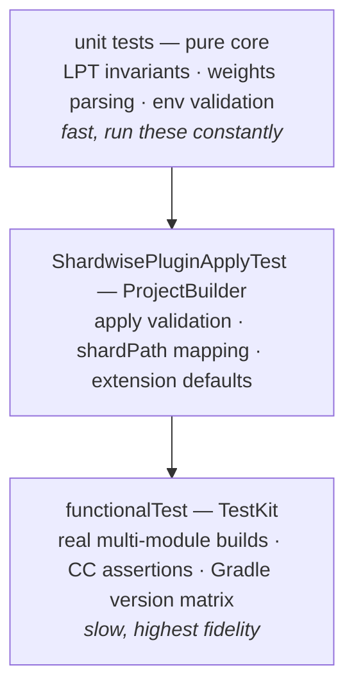

# Contributing to Shardwise

How to build, test, and submit changes while keeping the public API, coverage
invariant, and configuration cache safe.

## Goal

Ship a change without breaking the public API, the coverage invariant, or the
configuration cache.

## Prerequisites

- **JDK 17+** on `JAVA_HOME` (no toolchain auto-provisioning configured).
- Write access to a checkout of the project.

## Step 1 — Build & test

Three commands cover the three test layers:

```bash
./gradlew test              # unit tests (pure planning logic + ProjectBuilder glue tests)
./gradlew functionalTest    # TestKit tests: real multi-module builds, Gradle version matrix
./gradlew check             # everything above + apiCheck + validatePlugins — run before a PR
```

Functional tests download Gradle distributions (8.11, 8.14.x, 9.x) on first
run. They are the source of truth for plugin behaviour — run them for any change
to `ShardwisePlugin`, `ShardBuildService`, or `NodeEnvValueSource`.

## Step 2 — Pick the right test layer

The codebase has two layers: a pure planning core (`internal/TestShardPlanner`,
`internal/TestWeights`, no Gradle types) and Gradle glue (`ShardwisePlugin`,
`internal/ShardBuildService`, `internal/NodeEnvValueSource`). Put new planning
logic in the pure core. The design is documented in
[docs/how-it-works.md](docs/how-it-works.md). Put new tests at the cheapest
level that catches the regression:



## Step 3 — Respect the hard rules

`check` and code review enforce these rules; PRs that break them won't be merged.

### Step 3a — Keep the public API frozen

The plugin ID `de.micschro.shardwise`, the `shardwise` extension, and everything
recorded in `api/*.api` must stay binary compatible. `apiCheck` gates this. If
you deliberately widen the API, regenerate the dump with `./gradlew apiDump` and
include it in the PR. Kotlin `explicitApi()` is on: everything outside
`internal/` is public API.

### Step 3b — Preserve coverage

Unknown modules, unknown task names, and missing or stale weights must default
to *running*, never to being skipped. Every change to planning or skipping logic
needs a test that demonstrates coverage is preserved.

### Step 3c — Protect configuration-cache safety

No `afterEvaluate` or `projectsEvaluated`. Access the environment only through
the `ValueSource` API. Use lazy wiring only (`configureEach`, `onlyIf`,
providers). Every functional test asserts that the configuration cache engages
— keep it that way.

### Step 3d — Stay within the minimum Gradle API

Main sources compile against `gradle-api:8.11` (`compileOnly`). Don't use Gradle
APIs newer than 8.11 in `src/main`.

## Step 4 — Submit a PR

- Keep PRs focused: one logical change per PR.
- Add or extend tests at the appropriate layer (pure logic → unit test, glue →
  ProjectBuilder test, end-to-end behaviour → functional test).
- Update `CHANGELOG.md` under `[Unreleased]` for user-visible changes, then
  ensure `./gradlew check` passes locally.

## Step 5 — Report a bug

Include: plugin version, Gradle version, JDK version, your `shardwise { }`
configuration, the `CI_NODE_INDEX` / `CI_NODE_TOTAL` values, and — if possible
— a minimal reproducer or the output of the failing task with `--info`.

Suspected **lost test coverage** (a module skipped on every node) is the
highest-severity issue in this project; report it even without a reliable
reproducer.

## Don't

- **Don't widen the public API in a PR without regenerating `api/*.api` with
  `./gradlew apiDump`.** `apiCheck` gates the public surface; widening without
  `apiDump` makes the PR green but the next consumer breaks.
- **Don't introduce `afterEvaluate` or `projectsEvaluated`.** The configuration
  cache breaks on these calls. Every functional test asserts that the
  configuration cache engages — keep it that way.
- **Don't change planning or skipping logic without a test that demonstrates
  coverage is preserved.** Every default must err toward running.
- **Don't use Gradle APIs newer than 8.11 in `src/main`.** Main sources compile
  against `gradle-api:8.11` (`compileOnly`). A newer API will fail at runtime
  for consumers on 8.11.

---

Verification:
[ ] BLUF — outcome in first 2 sentences
[ ] Mode Purity — exactly one Diátaxis mode (How-to)
[ ] Concept Budget — ≤3 new concepts per section
[ ] Examples — ≥1 per concept
[ ] Anti-patterns — ≥3 "Don't" items
[ ] Terminology — one term per concept throughout
