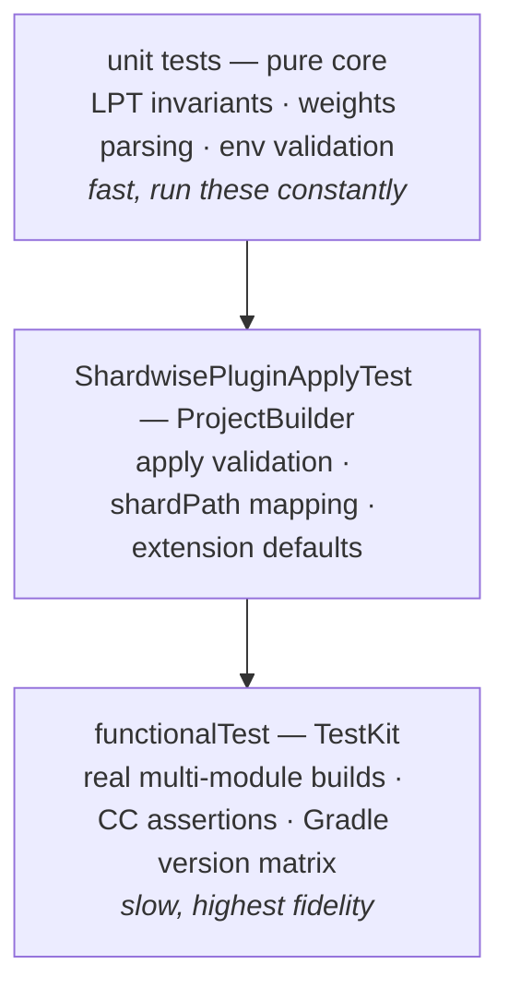

# Contributing to Shardwise

Bug reports, feature requests, and pull requests are welcome.

## Building

Requires **JDK 17+** on `JAVA_HOME` (no toolchain auto-provisioning is configured).

```bash
./gradlew test              # unit tests (pure planning logic + ProjectBuilder glue tests)
./gradlew functionalTest    # TestKit tests: real multi-module builds, Gradle version matrix
./gradlew check             # everything above + apiCheck + validatePlugins — run before a PR
```

The functional tests download Gradle distributions (8.5, 8.14.x, 9.x) on first run and
are the source of truth for plugin behaviour — always run them for changes to
`ShardwisePlugin`, `ShardBuildService`, or `NodeEnvValueSource`.

## Project layout

Two layers — pure planning core (`internal/TestShardPlanner`, `internal/TestWeights`,
no Gradle types) and Gradle glue (`ShardwisePlugin`, `internal/ShardBuildService`,
`internal/NodeEnvValueSource`); the design is documented in
[docs/how-it-works.md](docs/how-it-works.md). New planning logic goes into the pure
core. Put new tests at the cheapest level that can catch the regression:



## Hard rules

`check` and code review enforce these rules; PRs that break them won't be merged:

- **Public API is frozen.** The plugin ID `de.micschro.shardwise`, the `shardwise`
  extension, and everything recorded in `api/*.api` must stay binary compatible.
  `apiCheck` gates this. If you deliberately *widen* the API, regenerate the dump with
  `./gradlew apiDump` and include it in the PR. Kotlin `explicitApi()` is on:
  everything outside `internal/` is public API.
- **Coverage beats balance.** Unknown modules, unknown task names, and missing or
  stale weights must default to *running*, never to being skipped. Every change to
  planning or skipping logic needs a test that demonstrates coverage is preserved.
- **Configuration-cache safety.** No `afterEvaluate`/`projectsEvaluated`; environment
  access only through the `ValueSource`; lazy wiring only (`configureEach`, `onlyIf`,
  providers). Every functional test asserts that the configuration cache engages —
  keep it that way.
- **Minimum Gradle API.** Main sources compile against `gradle-api:8.5` (`compileOnly`).
  Don't use Gradle APIs newer than 8.5 in `src/main`.

## Pull requests

- Keep PRs focused: one logical change per PR.
- Add or extend tests at the appropriate layer (pure logic → unit test, glue →
  ProjectBuilder test, end-to-end behaviour → functional test).
- Update `CHANGELOG.md` under `[Unreleased]` for user-visible changes.
- Make sure `./gradlew check` passes locally.

## Reporting bugs

Please include: plugin version, Gradle version, JDK version, your `shardwise { }`
configuration, the `CI_NODE_INDEX`/`CI_NODE_TOTAL` values, and — if at all possible —
a minimal reproducer or the output of the failing task with `--info`.

Suspected **lost test coverage** (a module skipped on every node) is the
highest-severity issue this project can have; please report it even if you cannot
reproduce it reliably.
