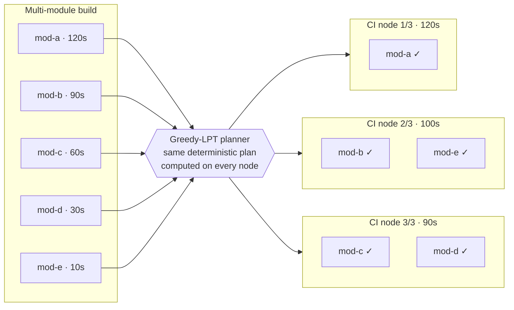

# Shardwise

[](https://github.com/micschr0/gradle-test-shard-plugin/actions/workflows/ci.yml)
[](LICENSE)

Shards a multi-module Gradle build's `test` tasks across parallel CI nodes via Greedy-LPT bin-packing. Each planned test module runs on exactly one node; on all other nodes its `test` task is `SKIPPED`. Modules not covered by a plan run on every node — coverage is never lost (see [docs/how-it-works.md](docs/how-it-works.md)).

- Root plugin, configuration-cache safe (BuildService + ValueSource, no `afterEvaluate`)
- Deterministic plan: same inputs → same distribution on every node
- Optional committed weights file for balanced shards; unknown modules default to running



Design, guarantees, and limitations: [docs/how-it-works.md](docs/how-it-works.md).

## Installation

> **Status:** not yet published to the Gradle Plugin Portal. Until then, build it from
> source and resolve it from `mavenLocal()`:

```bash
git clone https://github.com/micschr0/gradle-test-shard-plugin.git
cd gradle-test-shard-plugin && ./gradlew publishToMavenLocal
```

```kotlin
// settings.gradle.kts (your build)
pluginManagement {
    repositories {
        mavenLocal()
        gradlePluginPortal()
    }
}
```

The version in the `plugins` block below must match the version you built —
`version = "0.1.0"` in this repository's `build.gradle.kts`.

## Usage

Apply to the **root project**. This alone shards `test` across nodes, weighting every module equally:

```kotlin
// build.gradle.kts (root)
plugins {
    id("de.micschro.shardwise") version "0.1.0"
}
```

The plugin reads `CI_NODE_INDEX` / `CI_NODE_TOTAL` (1-based) from the environment.

**Builds without these variables — local runs, PR pipelines without `parallel:` — run every test task; nothing is sharded or skipped.** If either variable is set, both must be valid: a non-numeric value or an out-of-range index fails the build immediately, because a silently mis-parsed index would skip one node's assigned modules on every node.

On node 2 of 3 the output looks like this:

```text
$ CI_NODE_INDEX=2 CI_NODE_TOTAL=3 ./gradlew test
> Task :mod-a:test SKIPPED
> Task :mod-b:test
> Task :mod-c:test SKIPPED
> Task :mod-d:test SKIPPED
```

Run this locally to see any node's plan without a CI setup. To inspect why a task was
skipped, see [Observing the plan](docs/how-it-works.md#observing-the-plan).

### Configuration

All settings are optional:

```kotlin
shardwise {
    // which Test tasks to shard; each gets its own independent plan (default: ["test"])
    taskNames.set(setOf("test", "integrationTest"))
    // committed per-module weights (e.g. measured timings), `modulePath=millis` per line
    weightsFile.set(layout.projectDirectory.file("test-weights.properties"))
    // weight for modules absent from the file (default 10)
    defaultWeight.set(10)
}
```

Test tasks not listed in `taskNames` are never skipped. The root project's own test tasks are sharded like any module (weights key: `.`).

### GitLab CI

GitLab sets both variables automatically with `parallel:`:

```yaml
test-backend:
  stage: test
  parallel: 3                      # → CI_NODE_TOTAL=3, CI_NODE_INDEX=1..3
  script:
    - ./gradlew test
  artifacts:
    when: always
    reports:
      junit:
        - "**/build/test-results/test/TEST-*.xml"
```

### Other CI providers

The mechanism is CI-agnostic — only the variable names follow GitLab's convention. Map your provider's variables (mind 0- vs 1-based indices):

```yaml
# GitHub Actions
strategy:
  matrix: { shard: [1, 2, 3] }
env:
  CI_NODE_INDEX: ${{ matrix.shard }}
  CI_NODE_TOTAL: 3
```

```yaml
# CircleCI (CIRCLE_NODE_INDEX is 0-based)
parallelism: 3
environment:
  CI_NODE_TOTAL: "3"
steps:
  - run: CI_NODE_INDEX=$((CIRCLE_NODE_INDEX + 1)) ./gradlew test
```

```yaml
# Buildkite (BUILDKITE_PARALLEL_JOB is 0-based)
parallelism: 3
command: >-
  CI_NODE_INDEX=$((BUILDKITE_PARALLEL_JOB + 1))
  CI_NODE_TOTAL=$BUILDKITE_PARALLEL_JOB_COUNT
  ./gradlew test
```

## Weights file

Optional — without a weights file every module gets `defaultWeight`, so the plan balances module *count* instead of duration. Commit a weights file when the imbalance costs you CI time.

```properties
# modulePath=millis (module path with '/' instead of ':', no leading ':'; root project = '.')
services/checkout/checkout-service=120000
common/common-domain=500
```

Modules not listed get `defaultWeight`; the same per-module weight feeds every task type's plan. Malformed lines — no `=`, non-numeric or negative values — are ignored, and the affected module falls back to `defaultWeight`. Weights affect balance, never coverage: stale weights shift load but never lose tests.

**Requirement:** all parallel nodes of a run must read the *identical* weights file — committed to git or distributed as a single pipeline artifact. A CI cache read independently by each node is unsafe: caches may serve different states to different runners.

To generate the file from JUnit XML timings and keep it fresh automatically, see [docs/self-updating-weights.md](docs/self-updating-weights.md).

## Compatibility

Gradle 8.5+ (built against the 8.5 API and tested against 8.5, 8.14 and 9.x), Java 17+.
Works with the configuration cache, parallel execution, and lazily registered test
suites (`testing { suites { ... } }`); functional tests cover both Kotlin and Groovy
DSL consumers.

## Contributing

See [CONTRIBUTING.md](CONTRIBUTING.md) for the build setup, the project's hard
invariants, and PR guidelines.

## License

[Apache-2.0](LICENSE)
