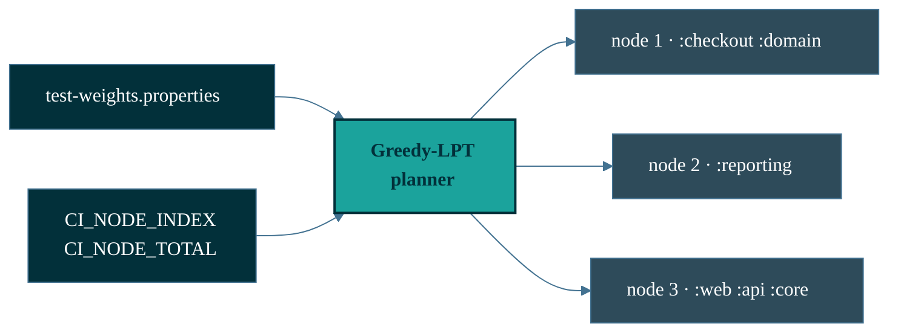

<div align="center">

<picture>
  <source media="(prefers-color-scheme: dark)" srcset="docs/assets/shardwise-logo-dark.svg">
  
</picture>

# Shardwise

[](https://github.com/micschr0/gradle-test-shard-plugin/actions/workflows/ci.yml)
[](https://github.com/micschr0/gradle-test-shard-plugin/releases)
[](https://scorecard.dev/viewer/?uri=github.com/micschr0/gradle-test-shard-plugin)
[](https://gradle.org)
[](https://openjdk.org)
[](LICENSE)

</div>

---

## Runtime-balanced sharding

```text
              node 1        node 2        node 3     wall time
1 node        ████████████████████████                 4810 ms
3 · by count  ████████████  ████████      ████          2440 ms  ← slowest node wins
3 · by time   ██████████    █████████     █████████     1840 ms  ← packed by runtime
```

Modules packed by measured test runtime, not count. Every module runs on exactly
one node — same suite, same coverage.

<sub>Illustrative. [How many nodes →](#how-many-nodes)</sub>

---

## Get started

```kotlin
// root build.gradle.kts
plugins {
  id("de.micschro.shardwise") version "0.4.1"
}
```

```bash
./gradlew test --no-build-cache                   # real timings, not cached
./gradlew generateTestWeights                     # writes test-weights.properties
git add test-weights.properties && git commit     # commit it — nodes need identical input

CI_NODE_TOTAL=3 CI_NODE_INDEX=1 ./gradlew test    # sharded
```

> [!WARNING]
> `CI_NODE_INDEX` is **1-based**. On 0-based CI (GitHub Actions matrix,
> CircleCI), add 1. Unset locally = every test runs.

Set the two env vars per CI job — no coordinator, every node derives the same plan.

```text
config-cache safe   ·   no SaaS · no network · no telemetry   ·   remove 1 line to revert
```

Every module runs on exactly one node, never zero
([coverage beats balance](docs/how-it-works.md#1-coverage-beats-balance)).

<details>
<summary>How the plan is built</summary>



</details>

<sub>Provider snippets → [install.md](docs/install.md).</sub>

---

## How many nodes

```bash
./gradlew shardwiseAnalyze
```

```text
  1 node   ████████████████████████  4810 ms
  2 nodes  ████████████             2405 ms
  3 nodes  █████████                1840 ms  ◄ floor
  6 nodes  █████████                1840 ms  ◄ no gain
```

Floor = heaviest module (`:reporting`). Past it, extra nodes idle. Split it to go lower.

---

<details>
<summary><b>What a sharded node prints</b></summary>

<br/>

```text
── SHARDWISE · test ──────────────

  Node          1 of 3
  Running here  2 of 6 modules
  Skipped here  4 (on other nodes)

  Modules   :services:checkout
            :common:domain

──────────────────────────────────
```

</details>

---

## Docs

| Page | Covers |
|------|--------|
| [Install](docs/install.md) | Apply, configure tasks, any CI provider |
| [Self-updating weights](docs/self-updating-weights.md) | Generate + auto-refresh `test-weights.properties` |
| [Migration](docs/tutorial-migrate.md) | Step-by-step, from hand-rolled sharding |
| [Configuration](docs/configuration.md) | `shardwise {}`, `PlanDetail`, plan-only, weights format |
| [How it works](docs/how-it-works.md) | Greedy-LPT, 4/3 bound, coverage guarantee, rationale |
| [Troubleshooting](docs/troubleshooting.md) | Common CI and dev issues |

Shards `test`, `integrationTest`, or any `Test` task — independent plan each.

<sub>Pre-1.0: API may change between releases. See [CHANGELOG](CHANGELOG.md).</sub>

---

## Contributing

[CONTRIBUTING.md](CONTRIBUTING.md) · [SUPPORT.md](SUPPORT.md) · [SECURITY.md](SECURITY.md) · single maintainer.

**License:** [Apache-2.0](LICENSE)
