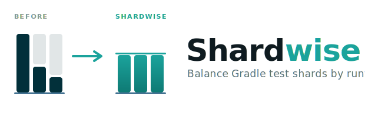
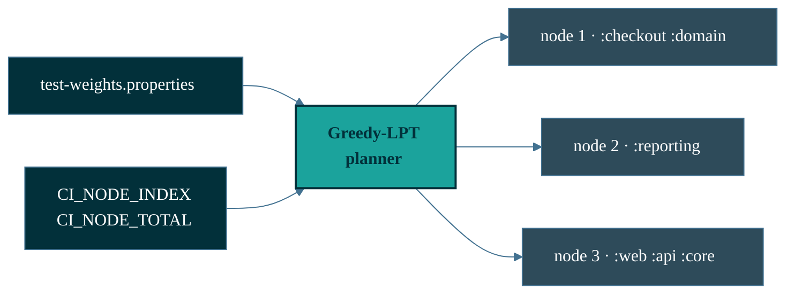

<div align="center">

<picture>
  <source media="(prefers-color-scheme: dark)" srcset="docs/assets/shardwise-logo-dark.svg">
  
</picture>

[](https://github.com/micschr0/gradle-test-shard-plugin/actions/workflows/ci.yml)
[](https://github.com/micschr0/gradle-test-shard-plugin/releases)
[](https://scorecard.dev/viewer/?uri=github.com/micschr0/gradle-test-shard-plugin)
[](https://gradle.org)
[](https://openjdk.org)
[](LICENSE)

</div>

---

```text
              node 1        node 2        node 3     wall time
1 node        ████████████████████████                 4810 ms
3 · by count  ████████████  ████████      ████          2440 ms  ← slowest node wins
3 · by time   ██████████    █████████     █████████     1840 ms  ← packed by runtime
```

Modules packed by measured test runtime, not count. Same suite, same coverage.

---

## Get started

Record weights once locally. Set two env vars per CI job.
No coordinator: every node derives the same plan.

```kotlin
// root build.gradle.kts
plugins {
  id("de.micschro.shardwise") version "0.4.1"
}
```

```bash
# once, locally: measure real per-module timings
./gradlew test --no-build-cache
./gradlew generateTestWeights                  # writes test-weights.properties
git add test-weights.properties                # commit: every node needs identical input
```

```bash
# per CI job, the only thing CI sets
CI_NODE_TOTAL=3 CI_NODE_INDEX=1 ./gradlew test
```

> [!WARNING]
> `CI_NODE_INDEX` is **1-based**. On 0-based CI (GitHub Actions matrix,
> CircleCI), add 1. Unset locally = every test runs.

<sub>Keep weights fresh from CI instead? See [self-updating weights](docs/self-updating-weights.md).</sub>

```text
config-cache safe   ·   no SaaS · no network · no telemetry   ·   remove 1 line to revert
```

Every module runs on exactly one node, never zero
([coverage beats balance](docs/how-it-works.md#1-coverage-beats-balance)).

<details>
<summary>How the plan is built</summary>



</details>

<sub>Provider snippets: [install.md](docs/install.md).</sub>

---

## Confirm it sharded

Every sharded `test` run prints a banner: which node, and which modules ran
here versus skipped on other nodes. Node 1 and node 2 show different module
sets with no overlap. That is the split working.

```text
  ╭─ S H A R D W I S E ──────────────────────────────────
  │ ██████████████████████▓▓▓▓▓▓▓▓▓▓▓▓▓▓▓▓▓▒▒▒▒▒▒▒▒▒▒▒▒▒▒
  │ ██████████████████████
  │ ▓▓▓▓▓▓▓▓▓▓▓▓▓▓▓▓▓
  │ ▒▒▒▒▒▒▒▒▒▒▒▒▒▒
  ├─ test ───────────────────────────────────────────────
  │ Node          1 of 3
  │ Running here  2 of 6 modules
  │ Skipped here  4 (run on other nodes, shown as ':<module>:test SKIPPED')
  │
  │ Modules running here
  │   :services:checkout
  │   :common:domain
  ╰──────────────────────────────────────────────────────
```

All 6 modules run once across the 3 nodes. Never zero, never twice.

---

## How many nodes

```bash
./gradlew shardwiseAnalyze
```

```text
[shardwise] WEIGHTS ANALYSIS
[shardwise]   modules:   6
[shardwise]   total:     4810ms
[shardwise]   mean:      801ms
[shardwise]   median:    700ms
[shardwise]   p95:       1840ms
[shardwise]   imbalance: 2.30x
[shardwise]
[shardwise] TOP 3 HEAVIEST
[shardwise]   1. :reporting 1840ms (38.3%)
[shardwise]   2. :web 900ms (18.7%)
[shardwise]   3. :api 780ms (16.2%)
```

The heaviest module is the wall-time floor: no node finishes faster than
`:reporting` at 1840ms, whatever the node count. `imbalance` is that module
over the mean. Split the heaviest module to push the floor lower.

---

## Docs

| Page | Covers |
|------|--------|
| [Install](docs/install.md) | Apply, configure tasks, any CI provider |
| [Self-updating weights](docs/self-updating-weights.md) | Generate + auto-refresh `test-weights.properties` |
| [Migration](docs/tutorial-migrate.md) | Step-by-step, from hand-rolled sharding |
| [Configuration](docs/configuration.md) | `shardwise {}`, `PlanDetail`, plan-only, weights format |
| [How it works](docs/how-it-works.md) | Greedy-LPT, 4/3 bound, coverage guarantee, rationale |
| [Troubleshooting](docs/troubleshooting.md) | Common CI and dev issues |

Shards `test`, `integrationTest`, or any `Test` task, one plan each.

<sub>Pre-1.0: API may change between releases. See [CHANGELOG](CHANGELOG.md).</sub>

---

## Contributing

[CONTRIBUTING.md](CONTRIBUTING.md) · [SUPPORT.md](SUPPORT.md) · [SECURITY.md](SECURITY.md) · single maintainer.

**License:** [Apache-2.0](LICENSE)
