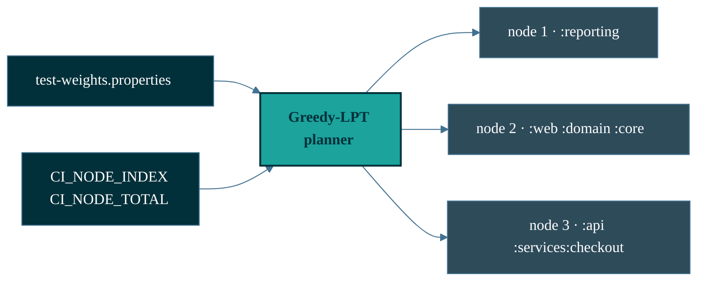

<div align="center">

<picture>
  <source media="(prefers-color-scheme: dark)" srcset="docs/assets/shardwise-logo-dark.svg">
  
</picture>

[](https://github.com/micschr0/gradle-test-shard-plugin/actions/workflows/ci.yml)
[](https://github.com/micschr0/gradle-test-shard-plugin/releases)
[](https://scorecard.dev/viewer/?uri=github.com/micschr0/gradle-test-shard-plugin)
[](https://gradle.org)
[](https://openjdk.org)
[](LICENSE)

</div>

---

Splitting a Gradle test suite across CI nodes by module count leaves nodes
idle: one node draws the slow modules, the rest finish early and wait. Shardwise
packs modules by their **measured** runtime instead, so every node finishes at
roughly the same time.

```text
                node 1        node 2        node 3      wall time
1 node          ████████████████████████                  24 min
3 · by count    ████████████  ████████      ████          12 min  ← slowest node wins
3 · by runtime  █████████     ████████      ███████        9 min  ← packed by runtime
```

Same suite, same tests, same coverage — only the assignment changes.

---

## Is this for you?

Shardwise pays off when all three hold:

- **Multi-module build.** Sharding happens per Gradle module, so a single-module
  build has nothing to split.
- **Tests dominate wall time.** If compilation is your bottleneck, fix that first.
- **Uneven modules.** If every module takes the same time, splitting by count is
  already optimal and you need no plugin.

Nothing runs off your machine: no SaaS, no network calls, no telemetry.
Configuration-cache safe. Removing the plugin line restores the old behaviour.

---

## Get started

Record weights once locally, then set two environment variables per CI job.
There is no coordinator — every node derives the same plan from the same file.

```kotlin
// root build.gradle.kts
plugins {
  id("de.micschro.shardwise") version "0.4.1"
}
```

```bash
# once, locally: measure real per-module timings
./gradlew test --no-build-cache     # cached tasks report no timings
./gradlew generateTestWeights       # writes test-weights.properties
git add test-weights.properties     # commit: every node needs identical input
```

The generated file is one line per module, milliseconds, keyed by Gradle path
with `/` instead of `:` (a `.properties` key cannot contain `:`):

```properties
reporting=1840
web=900
services/checkout=600
```

Nested modules use their full Gradle path: `:services:checkout` is keyed
`services/checkout`, and the root project is keyed `.`.

```bash
# per CI job, the only thing CI sets
CI_NODE_TOTAL=3 CI_NODE_INDEX=1 ./gradlew test
```

> [!WARNING]
> `CI_NODE_INDEX` is **1-based**. On 0-based CI (GitHub Actions matrix,
> CircleCI), add 1. With both variables unset, the plugin is a no-op and every
> test runs.

Every module lands on exactly one node, never zero — unknown modules, unknown
task names and stale weights all default to *running*
([coverage beats balance](docs/how-it-works.md#1-coverage-beats-balance)).

<sub>Prefer weights refreshed from CI? See [self-updating weights](docs/self-updating-weights.md).
Per-provider CI snippets live in [install.md](docs/install.md).</sub>

<details>
<summary>How the plan is built</summary>



Longest-processing-time-first: sort modules by weight descending, put each on
the node with the least load so far. Deterministic — identical inputs produce
identical plans on every node, with no cross-node communication.

</details>

---

## Configure

The defaults shard the `test` task using `test-weights.properties`. Override
only what you need:

```kotlin
// root build.gradle.kts
shardwise {
  taskNames.set(setOf("test", "integrationTest"))  // one plan per task
  defaultWeight.set(10)                            // for modules without timings
}
```

Each task name gets its own independent plan. Full reference —
`weightsFile`, `planDetail`, plan-only mode, weights file format — in
[configuration.md](docs/configuration.md).

---

## How many nodes do you need?

```bash
./gradlew shardwiseAnalyze
```

```text
[shardwise] WEIGHTS ANALYSIS
[shardwise]   modules:   6
[shardwise]   total:     4810ms
[shardwise]   mean:      801ms
[shardwise]   median:    600ms
[shardwise]   p95:       1840ms
[shardwise]   p99:       1840ms
[shardwise]   imbalance: 2.30x
[shardwise]
[shardwise] TOP 6 HEAVIEST
[shardwise]   1. :reporting 1840ms (38.3%)
[shardwise]   2. :web 900ms (18.7%)
[shardwise]   3. :api 780ms (16.2%)
[shardwise]   4. :services/checkout 600ms (12.5%)
[shardwise]   5. :domain 400ms (8.3%)
[shardwise]   6. :core 290ms (6.0%)
```

Your heaviest module is the wall-time floor: no node can finish before
`:reporting` does, no matter how many nodes you add. `imbalance` is that
floor divided by the mean — at `2.30x`, the heaviest module takes more than
twice the average, so nodes past the third mostly idle. To go faster, split the
heaviest module rather than adding nodes.

Read-only: the task inspects weights and never runs a test.

---

## Docs

| Page | Covers |
|------|--------|
| [Install](docs/install.md) | Apply, configure tasks, any CI provider |
| [Self-updating weights](docs/self-updating-weights.md) | Generate + auto-refresh `test-weights.properties` |
| [Migration](docs/tutorial-migrate.md) | Step-by-step, from hand-rolled sharding |
| [Configuration](docs/configuration.md) | `shardwise {}`, `PlanDetail`, plan-only, weights format |
| [How it works](docs/how-it-works.md) | Greedy-LPT, 4/3 bound, coverage guarantee, rationale |
| [Troubleshooting](docs/troubleshooting.md) | Verify the split, diagnose gaps and duplicates |

<sub>Pre-1.0: the API may change between releases. See [CHANGELOG](CHANGELOG.md).</sub>

---

## Contributing

[CONTRIBUTING.md](CONTRIBUTING.md) · [SUPPORT.md](SUPPORT.md) · [SECURITY.md](SECURITY.md)

**License:** [Apache-2.0](LICENSE)
