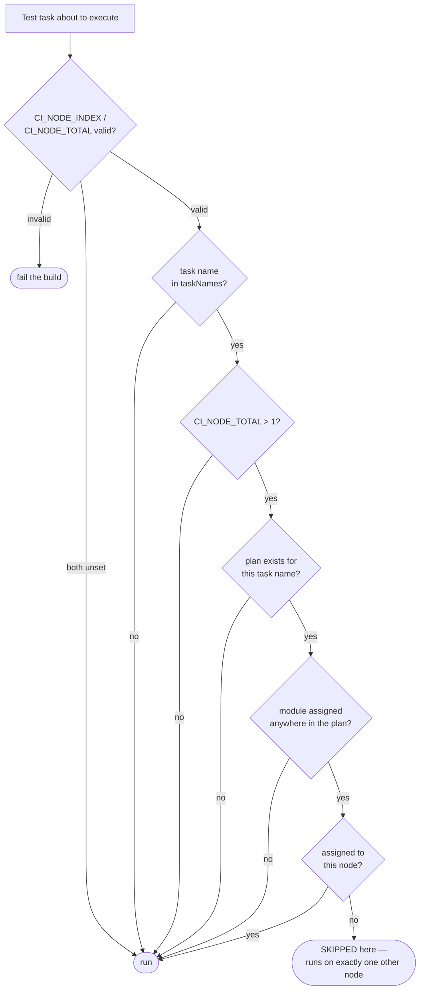
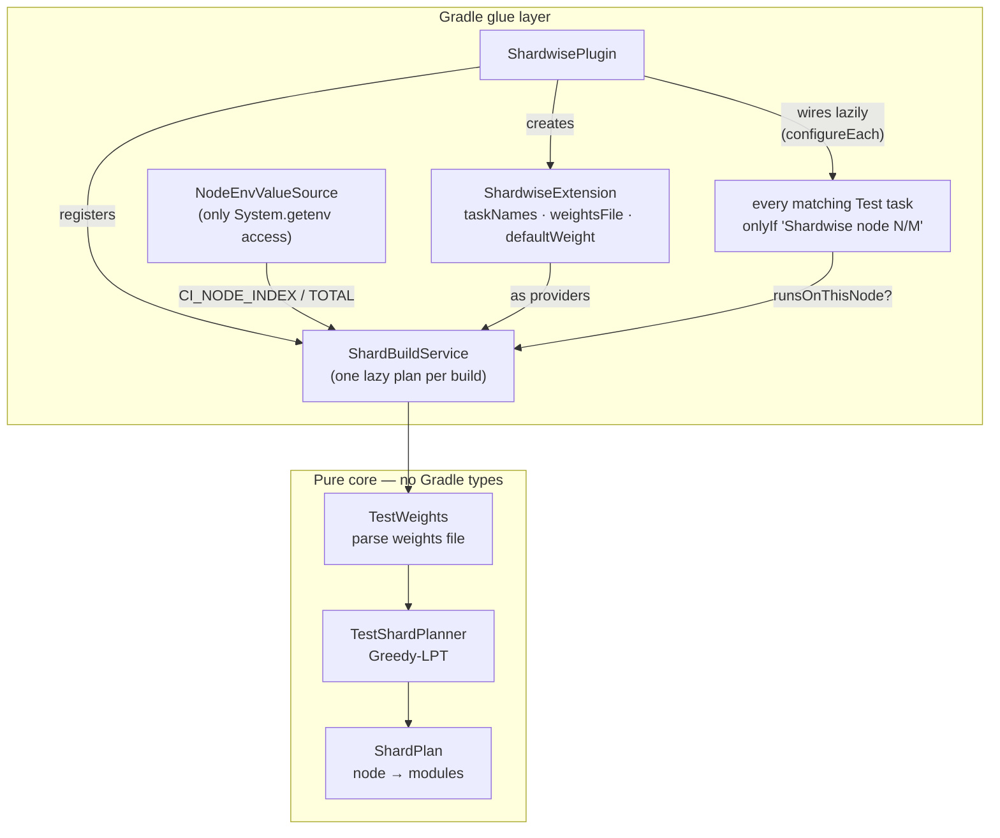
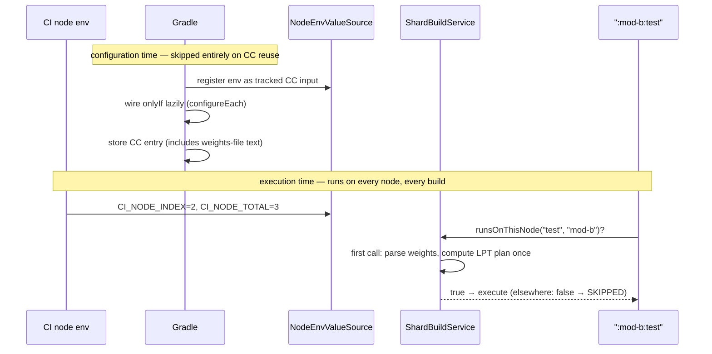

<!-- authoring-audit: 2026-07-16 BLUF,ModePurity,ConceptBudget,Examples,AntiPatterns,Terminology -->

# How Shardwise works

Shardwise distributes weighted test modules across N parallel CI nodes using Greedy-LPT bin-packing, producing a deterministic plan that keeps every module running on exactly one node. After reading this, you can predict which module lands where and why the planner errs toward running, never skipping, when in doubt.

> **Glossary.** In this explanation: **module** means a Gradle subproject, **CI node** is the runner that executes a job, **plan** is the deterministic shard assignment (not "shard plan" or "partition"), and **weights** are relative timing values per module. See the [configuration reference](configuration.md) for the canonical DSL terms.
>
## The problem

The slowest CI node determines a multi-module build's total test time. Naive sharding (`hash(module) % N`, alphabetical round-robin) distributes module *counts* evenly, but module test *durations* can span three orders of magnitude — one node gets the 20-minute service suite, another gets thirty 2-second domain modules.

Shardwise instead solves a classic scheduling problem: distribute weighted jobs (modules) across identical machines (CI nodes) so the slowest machine finishes as early as possible (minimum makespan).

```text
count-based round-robin                weight-based LPT
node 1  ████████████████████  20 min   node 1  ████████████  12 min
node 2  ██████                 6 min   node 2  ███████████   11 min
node 3  ████                   4 min   node 3  ███████████   11 min
        ▲ wall time: 20 min                    ▲ wall time: 12 min
```

## The algorithm: Greedy LPT

Exact makespan minimisation is NP-hard; Longest Processing Time (LPT) approximates it within 4/3 and can be made deterministic:

1. Sort modules by weight, descending; break ties by module path, ascending.
2. Assign each module to the currently lightest node.

Worked example with five modules on three nodes:

```text
step  module  weight │ node 1   node 2   node 3
──────────────────────┼─────────────────────────
  1   mod-a     120  │ ▶ 120        0        0
  2   mod-b      90  │   120     ▶ 90        0
  3   mod-c      60  │   120       90     ▶ 60
  4   mod-d      30  │   120       90     ▶ 90
  5   mod-e      10  │   120    ▶ 100       90
──────────────────────┼─────────────────────────
final load            │   120      100       90    makespan: 120
```

Ties (step 5: node 2 and node 3 both at 90) always resolve to the lowest node number, which keeps the plan deterministic.

The guarantee: the resulting makespan is at most 4/3 of the theoretical optimum (Graham, 1969). The unit test `greedy LPT keeps makespan within four thirds of optimum` pins the bound.

Weights are *relative*, not absolute: milliseconds from JUnit XML work, but so does any consistent unit. Missing weights fall back to `defaultWeight`, which only skews balance — never coverage (see *Coverage beats balance* below).

## The two invariants

Everything else in the codebase serves these two properties.

### 1. Coverage beats balance

A module must never be silently skipped on *every* node. The failure modes are ranked: duplicated test execution costs redundant CI runtime; a *lost* module makes CI report success for an untested, possibly failing module. Every default therefore errs toward running.

Every `Test` task takes this decision path at execution time; every uncertain branch ends in *run*:



A module absent from the plan runs on all nodes (`ShardPlan.runsOn`). A task name without a plan runs everywhere (`ShardBuildService.runsOnThisNode`). Test tasks not listed in `taskNames` are never touched.

### Interaction with edge cases

Three rules govern what happens when the inputs are unusual or broken:

- **CI_NODE_TOTAL ≤ 1 disables skipping entirely.** With only one target, every assigned module runs there — the plan still exists (it is deterministic and identical across imaginary peers), but no task evaluates to SKIPPED. This keeps local development and single-node CI identical to a multi-node run.
- **Malformed weight entries are ignored.** A non-numeric weight entry causes the module to fall back to `defaultWeight`. Stale weights shift load balance but never lose a test from coverage.
- **Invalid CI variables fail the build.** A `CI_NODE_INDEX` of 0, an invalid value, an out-of-range index, or a missing variable triggers a build failure instead of a silent guess: a mis-parsed index would skip one node's assigned modules on every node.

### 2. All nodes derive the identical plan

There is no coordinator. Each of the N parallel nodes independently computes the full plan and picks its own slice. The plan is correct only if every node produces the identical plan, which requires:

- **Deterministic planning** — the LPT sort is total (weight desc, then path asc), so the plan is invariant under module discovery order. The unit test `plan is invariant under input permutation` verifies this with shuffled inputs.
- **Identical inputs** — the weights file must be identical on all nodes of a run: committed to git or distributed as a single pipeline artifact. A CI cache read independently by each node is unsafe: caches may serve different states to different runners (see [self-updating-weights.md](self-updating-weights.md)).

## Architecture: pure core, thin glue

```text
src/main/kotlin/de/micschro/shardwise/
├── ShardwisePlugin.kt            Gradle glue (public)
├── ShardwiseExtension.kt         configuration surface (public)
└── internal/
    ├── TestShardPlanner.kt       pure: LPT planning, ShardPlan
    ├── TestWeights.kt            pure: weights-file parsing
    ├── ShardBuildService.kt      Gradle: one plan shared by all test tasks
    └── NodeEnvValueSource.kt     Gradle: CC-safe env access, validation
```

The planning layer (`TestShardPlanner`, `TestWeights`) has **no Gradle types** and is tested with plain unit tests. The diagram below shows how the pieces interact:



The glue layer wires it into Gradle:

- `ShardwisePlugin` registers the extension, collects which modules own which test tasks, and attaches an `onlyIf` predicate to every matching `Test` task.
- `ShardBuildService` is a shared `BuildService`: the plan is computed once per build (lazily, on first `onlyIf` evaluation) and shared by all test tasks.
- `NodeEnvValueSource` is the only place that touches `System.getenv`.

## Configuration-cache safety

The plugin is designed for Gradle's configuration cache (CC), which serialises the task graph and skips the configuration phase on subsequent runs. The constraints:

- **No `afterEvaluate`/`projectsEvaluated`** — all wiring is lazy (`configureEach`, providers). The module/task discovery runs inside a `Provider` that the build service evaluates at execution time, which is also why lazily registered tasks (e.g. `testing { suites { ... } }`) are captured correctly.
- **Env access only through a `ValueSource`** — Gradle tracks `NodeEnvValueSource` as a CC input, so a cached entry is transparently invalidated when `CI_NODE_INDEX` or `CI_NODE_TOTAL` change between runs. Reading `System.getenv` directly at configuration time would bake node 1's plan into the cache entry for every node.
- **The weights file is read into a `Provider<String>`** at configuration time, making the file content itself a CC input: edit the file, and the next run recomputes the plan (covered by the functional test `weights file changes take effect across configuration cache runs`).

A build on a CI node with a warm configuration cache:



Every functional test asserts that CC engages; treat a CC regression as a build-breaking bug.

## Why `onlyIf` and not task exclusion?

Skipping via `onlyIf` keeps the task in the graph with outcome `SKIPPED`:

- The decision happens at execution time, after CC restore, per node.
- Task dependencies stay intact — `check` still depends on `test` everywhere.
- CI reports show the module was *deliberately* skipped on this node rather than silently absent.

The trade-off: dependencies of a skipped test task (e.g. `testClasses`) may still run. That costs some compilation time on foreign nodes but keeps the mechanism free of graph rewiring.

## Observing the plan

The plugin has no report task; the assignment is visible through task outcomes:

- Skipped modules show `SKIPPED` in the console output (see the sample in the README).
- `./gradlew test --info` prints the reason: `Skipping task ':mod-a:test' as task onlyIf 'Shardwise node 2/3' is false.` (the reason shows the actual node and total).
- Inspecting the full plan means running the build once per node index — setting `CI_NODE_INDEX` to each value `1..N` in turn and comparing which test tasks execute.

## Scope and known limitations

- **Module granularity.** Shardwise shards whole modules, not individual test classes. If one module dominates total test time, split the module (or shard its classes with a separate in-module tool); no bin-packing can help a single indivisible 30-minute job.
- **Only `Test` tasks.** `taskNames` matches `org.gradle.api.tasks.testing.Test` tasks by name. Lifecycle tasks (`build`, `check`) are empty containers — skipping the container would not skip the work it depends on, so generalising to arbitrary task types needs validation first (planned for a later release).
- **Composite builds.** `includeBuild` builds have their own `Gradle` instance; their test tasks are not seen by the plugin and simply run on every node (coverage is preserved, work is duplicated).
- **Android.** Variant test tasks (`testDebugUnitTest`, …) are `Test` tasks and can be listed in `taskNames` explicitly; there is no variant-aware matching.
- **Coverage tools (JaCoCo).** Sharding itself is unaffected — JaCoCo
  instruments existing `Test` tasks. The catch is *where* the data lands:
  - Each module's execution data (`.exec`) is produced only on the node that ran
    it. On the other nodes `jacocoTestReport` has no data and is skipped.
  - Aggregated reports and threshold checks (`jacocoTestCoverageVerification`,
    SonarQube gates) must run in a **collect job** that merges the `.exec` (or
    XML) data of *all* nodes — a per-node check sees partial coverage and fails.
  - Use the same artifact pattern as for JUnit XML results. See
    [troubleshooting](troubleshooting.md) for a ready-made merge script.
