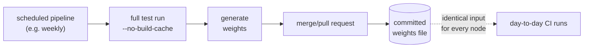
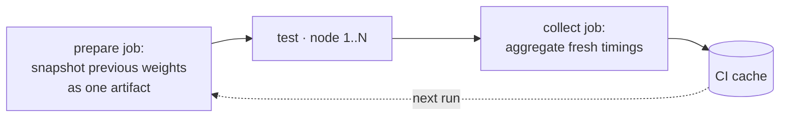

# Generating and updating test weights

The weights file maps module paths to relative durations (`modulePath=millis`, see the
[README](../README.md#weights-file)). This document covers generating it from JUnit XML
timings and keeping it fresh automatically.

One requirement governs every setup on this page: **all parallel nodes of a run must
read the identical weights file**, or their plans diverge and a module can be skipped
on every node. Committed files and pipeline artifacts guarantee this. A CI cache read
independently by each node is unsafe: caches may serve different states to different
runners. Use caches only as transport *between* runs.

## Generating the file

A full test run leaves per-module timings in the JUnit XML results. To aggregate them
(requires Python 3, standard library only):

```python
# generate-test-weights.py — run from the repo root after `./gradlew test`
import glob, xml.etree.ElementTree as ET

weights = {}
for f in glob.glob('**/build/test-results/test/TEST-*.xml', recursive=True):
    module = f.split('/build/test-results/')[0]
    if module == f:  # result lives directly under build/ → root project, key '.'
        module = '.'
    weights[module] = weights.get(module, 0) + float(ET.parse(f).getroot().get('time', '0'))

with open('test-weights.properties', 'w') as out:
    out.write('# generated from junit xml timings (millis)\n')
    for m, t in sorted(weights.items(), key=lambda kv: -kv[1]):
        out.write(f'{m}={int(t * 1000)}\n')
```

## Keeping weights fresh

Two automation variants. Stale weights shift balance but never lose tests, so neither
variant is load-bearing for correctness — refresh frequency only affects CI time.

### Variant A — scheduled job commits the file

Every distribution stays reproducible from the git history.



```yaml
# .gitlab-ci.yml — scheduled pipeline, e.g. weekly
update-test-weights:
  rules:
    - if: $CI_PIPELINE_SOURCE == "schedule"
  script:
    - ./gradlew test --no-build-cache   # force real execution; see build-cache note below
    - python3 generate-test-weights.py
    - |
      if ! git diff --quiet test-weights.properties; then
        git add test-weights.properties
        git commit -m "Update test weights"
        git push "https://ci:${PROJECT_TOKEN}@${CI_SERVER_HOST}/${CI_PROJECT_PATH}.git" \
          "HEAD:refs/heads/ci/update-test-weights" \
          -o merge_request.create -o merge_request.target=$CI_DEFAULT_BRANCH
      fi
```

```yaml
# .github/workflows/update-test-weights.yml
on:
  schedule:
    - cron: "0 3 * * 1"
jobs:
  update-weights:
    runs-on: ubuntu-latest
    steps:
      - uses: actions/checkout@v4
      - uses: actions/setup-java@v4
        with: { distribution: temurin, java-version: "17" }
      - run: ./gradlew test --no-build-cache   # force real execution; see build-cache note below
      - run: python3 generate-test-weights.py
      - uses: peter-evans/create-pull-request@v6
        with:
          branch: ci/update-test-weights
          title: Update test weights
          commit-message: Update test weights
```

### Variant B — every run feeds the next

A prepare job snapshots the previous run's weights into an artifact (identical for all
nodes), a collect job aggregates fresh timings for the next run. Fully automatic, but a
given commit no longer shards reproducibly — relevant when a historical run's node
assignment must be reconstructed, e.g. while debugging a failure that occurred on one
node.



```yaml
# .gitlab-ci.yml
stages: [prepare, test, collect]

weights:
  stage: prepare
  cache: { key: shardwise-weights, paths: [.shardwise/], policy: pull }
  script:
    - cp .shardwise/test-weights.properties test-weights.properties || echo "# none yet" > test-weights.properties
  artifacts: { paths: [test-weights.properties] }

test-backend:
  stage: test
  parallel: 3
  needs: [weights]
  script: ./gradlew test
  artifacts:
    when: always
    paths: ["**/build/test-results/test/TEST-*.xml"]
    reports:
      junit: ["**/build/test-results/test/TEST-*.xml"]

collect-weights:
  stage: collect
  needs: [test-backend]          # downloads artifacts of all parallel nodes
  cache: { key: shardwise-weights, paths: [.shardwise/], policy: push }
  script:
    - python3 generate-test-weights.py
    - mkdir -p .shardwise && cp test-weights.properties .shardwise/
```

```yaml
# .github/workflows/test.yml (sketch)
jobs:
  weights:
    runs-on: ubuntu-latest
    steps:
      - uses: actions/cache/restore@v4
        with:
          path: test-weights.properties
          key: shardwise-weights-${{ github.run_id }}
          restore-keys: shardwise-weights-
      - run: '[ -f test-weights.properties ] || echo "# none yet" > test-weights.properties'
      - uses: actions/upload-artifact@v4
        with: { name: shardwise-weights, path: test-weights.properties }

  test:
    needs: weights
    runs-on: ubuntu-latest
    strategy:
      matrix: { shard: [1, 2, 3] }
    env:
      CI_NODE_INDEX: ${{ matrix.shard }}
      CI_NODE_TOTAL: "3"
    steps:
      - uses: actions/checkout@v4
      - uses: actions/download-artifact@v4
        with: { name: shardwise-weights }
      - run: ./gradlew test
      - uses: actions/upload-artifact@v4
        if: always()
        with:
          name: test-results-${{ matrix.shard }}
          path: "**/build/test-results/test/TEST-*.xml"

  collect:
    needs: test
    runs-on: ubuntu-latest
    steps:
      - uses: actions/checkout@v4
      - uses: actions/download-artifact@v4
        with: { pattern: "test-results-*", merge-multiple: true }
      - run: python3 generate-test-weights.py
      - uses: actions/cache/save@v4
        with:
          path: test-weights.properties
          key: shardwise-weights-${{ github.run_id }}
```

## Interaction with the remote build cache

`FROM-CACHE` test tasks restore their JUnit XMLs *with the original timings*, so the
generator never sees zeros — but a plan assumes every module executes, while cache hits
cost ~0 at runtime. That skews balance (a node finishes early), never coverage.

The build cache interacts differently with the two variants:

- **Variant A** corrects only on schedule; day-to-day pipelines just consume the
  committed file. The `--no-build-cache` in the measuring job is there so timings come
  from *today's CI runner* executing the tests — not from whatever machine originally
  seeded the cache entry.
- **Variant B** self-corrects on every normal pipeline, with the build cache left on.
  A changed module misses the cache, really runs, and delivers a fresh timing; an
  unchanged module is restored `FROM-CACHE` with its old timing — which is still valid,
  precisely because the module didn't change. Timings refresh exactly when they could
  go stale.

Both combine well: B for continuous correction, A as an occasional full clean
re-measurement.
