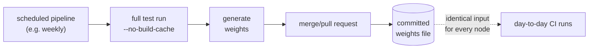
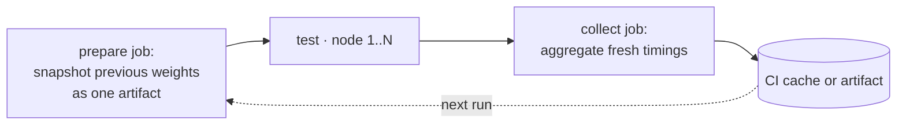

# Self-updating test weights

This page explains how to generate a `test-weights.properties` file from JUnit
XML timings and refresh it automatically so every parallel node in a CI pipeline
reads the same file.

## Contents

- [Goal](#goal)
- [Prerequisites](#prerequisites)
- [Step 1 — Generate the weights file](#step-1--generate-the-weights-file)
- [Step 2 — Commit the initial file](#step-2--commit-the-initial-file)
- [Step 3 — Choose a refresh strategy](#step-3--choose-a-refresh-strategy)
- [Step 4 — Verify](#step-4--verify)

## Goal

Maintain one weights file whose content is identical on every node of a
parallel run. When nodes read different weights, their plans diverge, and a
module may be skipped everywhere.

## Prerequisites

- Gradle (the plugin bundles the aggregator task — no Python required)
- A passing `./gradlew test` run that produces JUnit XML results in
  `**/build/test-results/test/`

## Step 1 — Generate the weights file

Run a full test suite, then aggregate the per-module timings with the bundled
`generateTestWeights` task. Run it from the repo root:

```bash
./gradlew test --no-build-cache
./gradlew generateTestWeights
```

The first command populates `**/build/test-results/test/TEST-*.xml`. The
second walks every `Test` task output declared in `taskNames` (default:
`test`), sums the `time=` attribute per module, and writes a sorted
ISO-8859-1 properties file (millisecond totals, descending by weight).

The output file maps each module path to its total duration in milliseconds:

```properties
services/checkout=12450
common/domain=8300
common/api=2100
```

## Step 2 — Commit the initial file

Commit the generated `test-weights.properties` to your repository. A committed
file is the simplest transport: every checkout delivers identical content to
every node, and the git history makes each commit's plan reproducible.

If you prefer not to commit, set up a pipeline artifact that a prepare job
produces once and every parallel node consumes. See Variant B in Step 3 for
that setup.

## Step 3 — Choose a refresh strategy

Stale weights shift balance but never lose tests, so neither variant is
load-bearing for correctness. Refresh frequency affects CI time, not coverage.

### Variant A — Scheduled job commits the file

A scheduled pipeline runs a full `--no-build-cache` test, regenerates the
weights, and opens a merge request only when the file changes.



GitLab CI example:

```yaml
# .gitlab-ci.yml — scheduled pipeline, e.g. weekly
update-test-weights:
  rules:
    - if: $CI_PIPELINE_SOURCE == "schedule"
  script:
    - ./gradlew test --no-build-cache
    - ./gradlew generateTestWeights
    - |
      if ! git diff --quiet test-weights.properties; then
        git add test-weights.properties
        git commit -m "Update test weights"
        git push "https://ci:${PROJECT_TOKEN}@${CI_SERVER_HOST}/${CI_PROJECT_PATH}.git" \
          "HEAD:refs/heads/ci/update-test-weights" \
          -o merge_request.create -o merge_request.target=$CI_DEFAULT_BRANCH
      fi
```

GitHub Actions example:

```yaml
# .github/workflows/update-test-weights.yml
on:
  schedule:
    - cron: "0 3 * * 1"
jobs:
  update-weights:
    runs-on: ubuntu-latest
    steps:
      - uses: actions/checkout@v4
      - uses: actions/setup-java@v4
        with: { distribution: temurin, java-version: "17" }
      - run: ./gradlew test --no-build-cache
      - run: ./gradlew generateTestWeights
      - uses: peter-evans/create-pull-request@v6
        with:
          branch: ci/update-test-weights
          title: Update test weights
          commit-message: Update test weights
```

### Variant B — Every run feeds the next

A prepare job snapshots the previous run's weights into one artifact that all
nodes share; a collect job aggregates fresh timings for the next run. The
refresh costs reproducibility: a given commit no longer shards the same way
twice.



GitLab CI example:

```yaml
# .gitlab-ci.yml
stages: [prepare, test, collect]

weights:
  stage: prepare
  cache: { key: shardwise-weights, paths: [.shardwise/], policy: pull }
  script:
    - cp .shardwise/test-weights.properties test-weights.properties || echo "# none yet" > test-weights.properties
  artifacts: { paths: [test-weights.properties] }

test-backend:
  stage: test
  parallel: 3
  needs: [weights]
  script: ./gradlew test
  artifacts:
    when: always
    paths: ["**/build/test-results/test/TEST-*.xml"]
    reports:
      junit: ["**/build/test-results/test/TEST-*.xml"]

collect-weights:
  stage: collect
  needs: [test-backend]
  cache: { key: shardwise-weights, paths: [.shardwise/], policy: push }
  script:
    - ./gradlew generateTestWeights
    - mkdir -p .shardwise && cp test-weights.properties .shardwise/
```

GitHub Actions example:

```yaml
# .github/workflows/test.yml (sketch)
jobs:
  weights:
    runs-on: ubuntu-latest
    steps:
      - uses: actions/cache/restore@v4
        with:
          { path: test-weights.properties, key: shardwise-weights-${{ github.run_id }}, restore-keys: shardwise-weights- }
      - run: '[ -f test-weights.properties ] || echo "# none yet" > test-weights.properties'
      - uses: actions/upload-artifact@v4
        with: { name: shardwise-weights, path: test-weights.properties }

  test:
    needs: weights
    runs-on: ubuntu-latest
    strategy:
      matrix: { shard: [1, 2, 3] }
    env:
      CI_NODE_INDEX: ${{ matrix.shard }}
      CI_NODE_TOTAL: "3"
    steps:
      - uses: actions/checkout@v4
      - uses: actions/download-artifact@v4
        with: { name: shardwise-weights }
      - run: ./gradlew test
      - uses: actions/upload-artifact@v4
        if: always()
        with:
          { name: test-results-${{ matrix.shard }}, path: "**/build/test-results/test/TEST-*.xml" }

  collect:
    needs: test
    runs-on: ubuntu-latest
    steps:
      - uses: actions/checkout@v4
      - uses: actions/download-artifact@v4
        with: { pattern: "test-results-*", merge-multiple: true }
      - run: ./gradlew generateTestWeights
      - uses: actions/cache/save@v4
        with:
          { path: test-weights.properties, key: shardwise-weights-${{ github.run_id }} }
```

## Step 4 — Verify

Confirm the weights file is identical on every node. The method depends on your
refresh strategy:

- **Variant A (committed)** — check that `git diff --quiet test-weights.properties`
  exits with zero on every node. If clean, every node reads the same committed
  file.
- **Variant B (artifacts)** — hash the weights artifact after each pipeline and
  confirm the hash is identical across nodes. A mismatch means the prepare job
  served different content to different runners.

### The build cache and verification

`FROM-CACHE` test tasks restore their JUnit XMLs with the original timestamps
and `time=` attributes. The generator sees the same values it saw after the
original execution. This matters during verification:

- The scheduled runner in **Variant A** passes `--no-build-cache` so timings
  come from today's CI runner executing the tests, not from the machine that
  seeded the cache entry.
- **Variant B** leaves the build cache on. A changed module misses the cache,
  runs anew, and delivers a fresh timing. An unchanged module is restored
  FROM-CACHE with its old timing — which remains valid because the module did
  not change. Timings refresh exactly when they could go stale.

To verify your setup independently of the build cache, run one pipeline with
`--no-build-cache` and compare the generated `test-weights.properties` against
your baseline.
