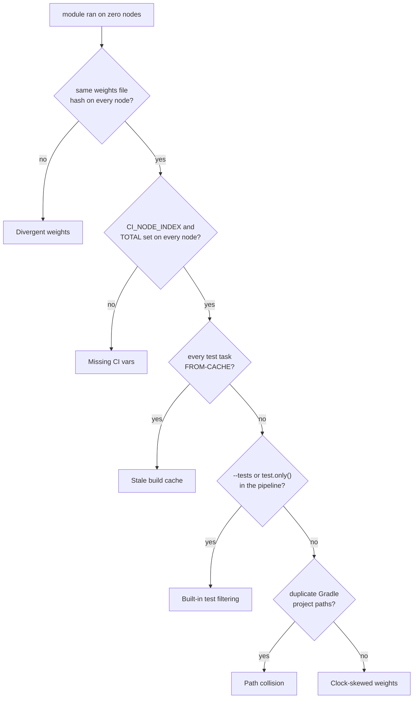

# Troubleshooting sharded builds

Diagnose and fix a sharded CI build where modules skip on all nodes or duplicate across nodes.

## Table of contents

- [Step 1 — Reproduce locally](#step-1--reproduce-locally)
- [Step 2 — Diagnose "ran on zero nodes"](#step-2--diagnose-ran-on-zero-nodes)
- [Step 3 — Retry semantics](#step-3--retry-semantics)
- [Step 4 — JaCoCo aggregation](#step-4--jacoco-aggregation)
- [Step 5 — Plan inspection](#step-5--plan-inspection)

## Prerequisites

Reproduce the problem locally before debugging in CI. Set both environment
variables manually and run with `--info`:

```bash
CI_NODE_INDEX=2 CI_NODE_TOTAL=3 ./gradlew test --info
```

The plugin is a no-op when both variables are unset, so local reproduction
requires them. See [Step 1](#step-1--reproduce-locally) for a full
cross-shard verification loop.

## Step 1 — Reproduce locally

Determinism means every CI node derives the same shard assignment from the same
inputs. Test it in a single shell loop: run each shard 1..N in sequence, grep
for skipped tasks, and verify no module appears on every shard or on more than
one.

```bash
#!/usr/bin/env bash
set -euo pipefail
N=3  # match CI_NODE_TOTAL

for i in $(seq 1 "$N"); do
    echo "=== Shard $i of $N ==="
    CI_NODE_INDEX=$i CI_NODE_TOTAL=$N ./gradlew test --info 2>&1 |
        grep -E "Skipping task '.+' as task onlyIf" |
        grep -oE ":[a-zA-Z0-9:_-]+:test" |
        sort -u > "/tmp/shard-$i.tasks"
    echo "  Tasks skipped on this node: $(wc -l < "/tmp/shard-$i.tasks")"
done

echo "=== Cross-shard check ==="
# Every task must skip on exactly N-1 nodes (i.e., run on exactly one).
present=$(mktemp)
for f in /tmp/shard-*.tasks; do cat "$f"; done | sort | uniq -c > "$present"
while read -r count task; do
    if [ "$count" -eq "$N" ]; then
        echo "FAIL: $task skipped on ALL $N shards — runs on zero nodes"
    elif [ "$count" -lt "$((N-1))" ]; then
        echo "FAIL: $task skipped on only $count of $N shards — runs on multiple nodes"
    fi
done < "$present"
echo "=== Determinism check complete ==="
```

**What to look for:**

- No task prints `FAIL` — every module runs on exactly one shard.
- The `grep -oE` expression extracts the full task path (`:services:checkout:test`),
  keeping every segment. Adjust the pattern if your task names end in something
  other than `:test`.
- The shard dump at [Step 5](#step-5--plan-inspection) gives a faster, cleaner
  check (no parsing needed, and it proves the *plan* matches, not just the
  execution outcome).

## Step 2 — Diagnose "ran on zero nodes"

A module that neither runs nor skips on any node means the plugin never saw it,
or every node decided it belongs elsewhere. Six causes produce this symptom.
Work down the tree, then jump to the matching section for the check and fix.



| Cause | Tell-tale sign |
|-------|----------------|
| [Divergent weights](#divergent-weights) | Weights file differs across nodes (different hash) |
| [Missing CI vars](#missing-ci_node_index--ci_node_total) | `CI_NODE_INDEX`/`CI_NODE_TOTAL` unset on one node |
| [Stale build cache](#build-cache-restores-stale-from-cache-timing) | Every node shows `FROM-CACHE` for every test task |
| [Clock-skewed weights](#ci-runner-clock-skewed-weights) | Weights file changes with no code/timing change |
| [Path collision](#project-path-collision) | Two modules share one Gradle project path |
| [Built-in test filtering](#built-in-test-filtering) | `test.only()` or `--tests` narrows the run on top of sharding |

### Built-in test filtering

Shardwise skips whole modules, not individual tests inside them. Gradle's own
filtering (`test.only()`, `--tests`) narrows the run *inside* the modules that
survived the shard decision, so the two compose: a test can be filtered out on
the one node that was supposed to run it.

**Check:** Look for `--tests` in the CI command line and `only()`/`filter {}` in
the build scripts.

**Fix:** Pick one mechanism. Use Shardwise to split across nodes, or Gradle
filtering to narrow a single run, but never both in the same pipeline stage.

### Divergent weights

Parallel CI nodes reading different weights files produce different plans. A
module assigned to node 2 in one plan and node 3 in another runs on neither.

**Check:** Compare the weights file on every node — size, hash, and content must
be identical. Log the hash in the pipeline setup step:

```bash
sha256sum test-weights.properties
```

**Fix:** Commit the weights file to the repo, or produce it as a shared pipeline
artifact before the parallel stage begins. Never let each node populate its own
cache entry independently.

### Missing CI_NODE_INDEX / CI_NODE_TOTAL

Without both variables, the plugin is a no-op — every task runs on every node.
One node with a missing variable and a second node with it set correctly creates
an invisible gap: the first node runs everything, the second skips some, and a
module that only runs on the second node was supposed to run on the first.

**Check:** Log the environment before Gradle starts:

```bash
echo "CI_NODE_INDEX=${CI_NODE_INDEX:-unset} CI_NODE_TOTAL=${CI_NODE_TOTAL:-unset}"
```

Expected output: `CI_NODE_INDEX=2 CI_NODE_TOTAL=3` (1-based).

**Fix:** Map your CI provider's parallelism variables explicitly. See the
[installation guide](install.md#step-3--wire-your-ci-provider) for each
provider's variable names and the 0-to-1 conversion.

### Build cache restores stale `FROM-CACHE` timing

The configuration cache stores the plan at build time. When a node restores from
`FROM-CACHE`, the stored plan reflects the *first* node that wrote it — and the
restoring node evaluates `onlyIf` against that cached plan, not the one it would
have derived. Every node that shares the same cache entry runs the same modules;
the rest run nothing.

**Check:** Grep the build log:

```bash
grep -c "FROM-CACHE" build.log
```

If every node shows `FROM-CACHE` for every test task, the plan was baked once
and broadcast.

**Fix:** Ensure each CI node gets a unique configuration-cache key, or disable
the configuration cache for sharded tasks (`--no-configuration-cache`). The
plugin itself is configuration-cache safe — what breaks is sharing one cached
plan across nodes.

### CI runner clock-skewed weights

A runner whose system clock is off by minutes or hours regenerates the weights
file with different header metadata or different content than another runner
produces. Git sees the change, the next CI run regenerates fresh weights from
stale measurements, and the bin-packer distributes load from corrupted timing
data, which may assign a heavy module to every node or to none.

**Check:** Compare the weights file from the two most recent CI runs:

```bash
git diff HEAD~1 -- test-weights.properties | head -20
```

Unexpected diffs, where no module was added and no timing changed, signal clock
drift. Comparing the file's commit timestamp against the runner's timestamp
reveals the same drift when the two differ by more than a few minutes.

**Fix:** Generate weights from a central job, not per-node. Use real wall-clock
timings (`system.millis` or test framework defaults) rather than the runner's
`date` command.

### Project path collision

Two modules with the same Gradle project path (`:services:checkout` and
`:services:checkout` in different builds) collapse to the same key in the
weights file. The bin-packer treats them as a single module and assigns one
weight to both: one gets the slot, the other runs nowhere.

**Check:** List duplicate project paths:

```bash
./gradlew projects 2>&1 | grep "^Project" | sort | uniq -d
```

Any duplicate output means two modules have the same path. Rename one in
`settings.gradle.kts` before using Shardwise.

## Step 3 — Retry semantics

Do not retry a single failed parallel node. Rerun the full job (all nodes).

**Why.** Shardwise assigns each module to exactly one node, so a retry of node 2
alone re-runs only node 2's modules. Coverage survives, because nodes 1 and 3
ran their modules on the first attempt, but no single attempt covers the whole
build. Proving the suite passed then means reading two logs side by side.

Rerunning the full job is unambiguous: every module runs exactly once in one
coordinated batch. The cost is repeating the passing nodes' work, which matters
on a large weights-skewed build. Keep the weights fresh (see
[Self-updating weights](self-updating-weights.md)) and that repeated work stays
small.

**Pipeline recommendation:** Use the CI provider's native retry-at-job-level
feature (GitLab CI `retry: 2`, GitHub Actions `jobs.<job_id>.strategy.fail-fast:
false` with a rerun trigger) rather than a script that detects failure and
re-dispatches a single matrix cell.

## Step 4 — JaCoCo aggregation

JaCoCo coverage is per-shard. To produce one aggregated report, merge the
`.exec` files from all nodes in a post-shard collect job. The following shell
snippet runs in a single job that has access to all nodes' `.exec` files (via
pipeline artifacts or shared storage):

```bash
#!/usr/bin/env bash
# Merge JaCoCo execution data across all shard nodes.
set -euo pipefail

JACOCO_VERSION=0.8.12
JACOCO_CLI_JAR=/tmp/jacococli.jar
JACOCO_CLI="java -jar $JACOCO_CLI_JAR"

if [ ! -f "$JACOCO_CLI_JAR" ]; then
    curl -sL "https://repo1.maven.org/maven2/org/jacoco/jacococli/${JACOCO_VERSION}/jacococli-${JACOCO_VERSION}.zip" \
        -o /tmp/jacococli.zip
    unzip -q -o /tmp/jacococli.zip jacococli.jar -d /tmp
fi

# Collect all .exec files produced across shards
exec_files=(shard-*/build/jacoco/test.exec)

if [ ${#exec_files[@]} -eq 0 ]; then
    echo "No .exec files found — did the shard jobs upload artifacts?"
    exit 1
fi

# Merge into a single aggregate .exec
$JACOCO_CLI merge "${exec_files[@]}" \
    --destfile merged.exec

# Generate an aggregated HTML report
# Requires class-files and source-files from each module;
# adjust paths to match your project layout.
$JACOCO_CLI report merged.exec \
    --classfiles build/classes/java/main \
    --sourcefiles src/main/java \
    --html jacoco-aggregate-report/
```

**Key design decisions:**

- The collect job runs **after** all shard jobs succeed, not in parallel.
- Every shard job must upload `.exec` files as artifacts with `when: always` (so
  a failure still produces partial data for debugging).
- The class-files and source-files paths must point at each module's output
  directories. For a typical multi-module Gradle build, use an
  `allprojects {}`-style strategy or a Gradle plugin that aggregates per-module
  paths into one report task (`jacocoTestReport` with `executionData`).
- Replace `shard-*/` with your CI provider's artifact layout. GitLab CI
  automatically names artifacts after the job; GitHub Actions stores them in a
  flat directory structure — adjust the glob accordingly.

## Step 5 — Plan inspection

The plugin can write the full plan (every node's assignment for every task type)
to a file for cross-node comparison. This is off by default — pass the system
property to enable it:

```bash
./gradlew test -Dshardwise.planDump=plans/node-$CI_NODE_INDEX.txt
```

**Where to look:** The file path is relative to the Gradle daemon's working
directory (typically the project root). Each CI node writes to its own path.
Use a shared directory name so the collect step can find all dumps.

**File format:** One line per node, `N=moduleA,moduleB` (sorted). Every node
writes the *full* plan, not just its own slice, so you can diff any two dumps
to confirm they agree:

```bash
diff plans/node-1.txt plans/node-2.txt   # identical if deterministic
```

A module listed on line `N` for two different values of `N` means the nodes
derived different plans; investigate divergent inputs (see
[Step 2](#step-2--diagnose-ran-on-zero-nodes)).

An idle node with zero modules assigned still gets a line like `3=`, so the
dump alone proves the node count.
